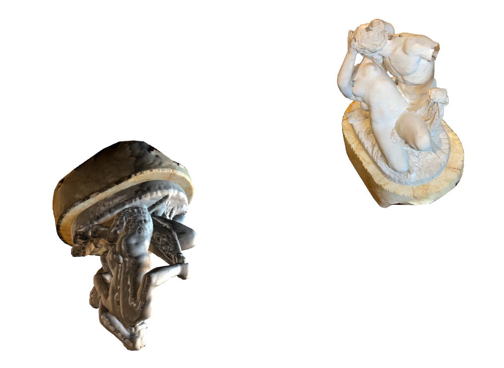
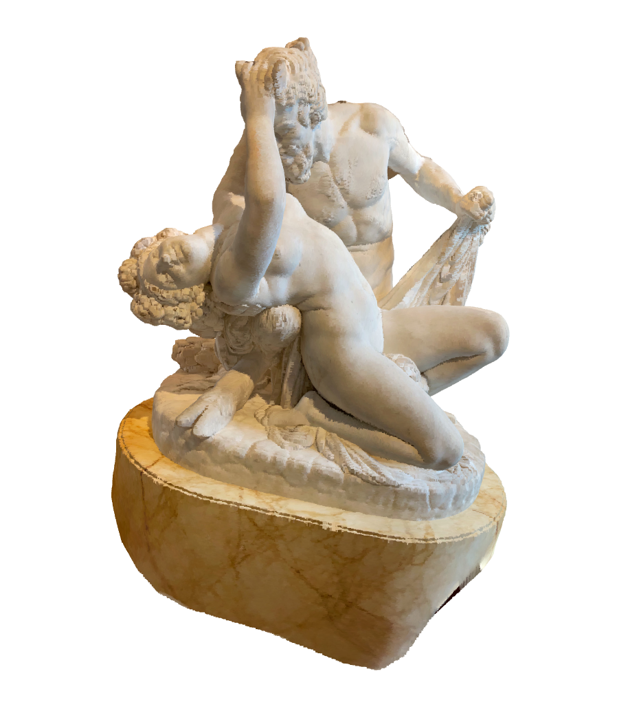
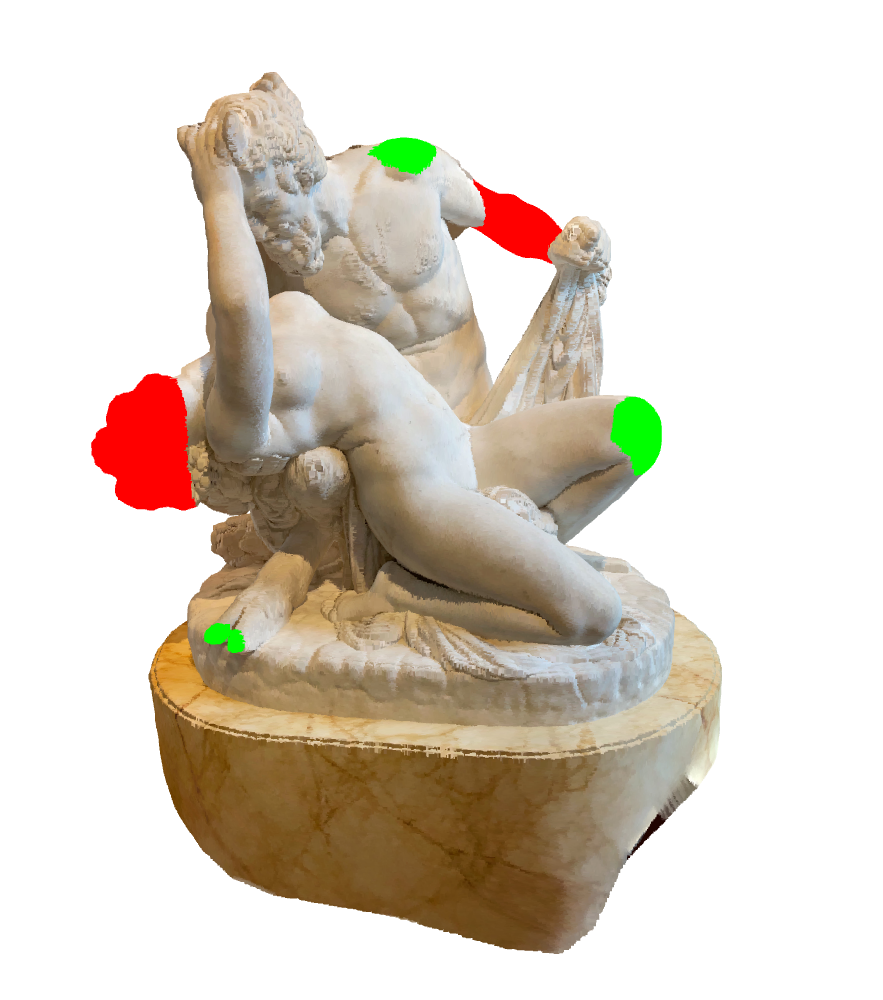

# ICP-Merging Project

## Overview

This project implements the **Iterative Closest Point (ICP)** algorithm to merge two 3D models in PLY format, including those generated using **Gaussian Splatting**. The ICP algorithm aligns and merges the models by minimizing the differences between their point clouds. The resulting merged model highlights differences between the two input models, with **green** indicating "new" parts and **red** indicating "eroded" parts. This is particularly useful for **cultural heritage** applications, where it can help visualize changes over time.

The project manipulates PLY files using the `PlyData` and `PlyFile` libraries, performing manual extraction, merging, and custom PLY file creation. It also supports Gaussian Splatting PLY files, which include additional features but require higher computational resources.

---

## Features

- **ICP Alignment**: Aligns two 3D models using the Iterative Closest Point algorithm.
- **PLY File Support**: Handles both standard PLY files and Gaussian Splatting PLY files.
- **Difference Highlighting**: Visualizes differences between the models using colors:
  - **Green**: Represents "new" parts (additions).
  - **Red**: Represents "eroded" parts (removals).
- **Gaussian Splatting Compatibility**: Supports advanced Gaussian Splatting PLY files for enhanced 3D representation.

---

## Installation

1. Clone the repository:

    ```sh
    git clone https://github.com/Martin-Martuccio/ICP-Merging.git
    cd ICP-Merging
    ```

2. Install the required dependencies:

    ```sh
    pip install -r requirements.yml
    ```

# Usage

## Prepare Input Models

Place your PLY files (standard or Gaussian Splatting) in the input folder (`data/input/`).

## Run the ICP-Merging Script

- Open the `main.py` file and update the paths to your input models:
  
  ```sh
    source_path = "data/input/model1.ply"
    target_path = "data/input/model2.ply"
  ```
  
- Run the script:
  
  ```sh
    python main.py
  ```

## Output

- The merged model will be saved as `merged_model.ply` in the output folder (`data/output/`).
  
- Differences between the models will be highlighted in green (new parts) and red (eroded parts).
  
# Example Workflow

We took the [Satiro e Baccante](https://poly.cam/capture/5621D36B-36BF-4655-AE5C-B2D68DF0A851?) statue (sculpted by James Pradier), from `poly.cam` website, as example.

## Input Models

- `model1.ply`: Represents the initial state of a cultural heritage site.
  
- `model2.ply`: Represents the current state of the same site.

## Merging Process

- The ICP algorithm aligns the two models.

|  |  |
|-------------------------------------------------------------|---------------------------------------------------------------|
  
- Differences are highlighted:
  
  - Green: New structures or additions.

  - Red: Eroded or missing structures.



## Output

- A single PLY file (`merged_model.ply`) is created, showing the aligned models with highlighted differences.

# Gaussian Splatting Support

This project supports Gaussian Splatting PLY files, which are advanced 3D representations that include additional features like density and splatting parameters. These files are particularly useful for high-quality 3D reconstructions but require more computational resources.

For more information on Gaussian Splatting, refer to:

- [Gaussian Splatting - Wikipedia](https://en.wikipedia.org/wiki/Gaussian_splatting)
  
- [Gaussian Splatting Paper (arXiv)](https://arxiv.org/abs/2308.04079)
  
# Future Work

- **Support for Splat PLY Files:** Enhance the project to handle Gaussian Splatting PLY files with additional features.
  
- **Performance Optimization:** Reduce computational costs for large models.
  
- **User Interface:** Develop a graphical interface for easier model selection, visualization and iteration.
  
# Collaborators

This project was developed by:

- [@Martin-Martuccio](https://github.com/Martin-Martuccio) - Martin Martuccio
  
- [@PSamK](https://github.com/PSamK) - Samuele Pellegrini
  
- [@biaperass](https://github.com/biaperass) - Bianca Perasso
  
- [@LorenzoMesi](https://github.com/LorenzoMesi) - Lorenzo Mesi
  
## Contact

For questions, issues, or collaborations, please contact:

- Martin Martuccio: [[martinmartuccio@gmail.com](Martin:martinmartuccio@gmail.com)]

- Samuele Pellegrini: [[pellegrini.samuele.1@gmail.com](Samuele:pellegrini.samuele.1@gmail.com)]

- Bianca Perasso: [[bianca.perasso@gmail.com](Bianca:bianca.perasso@gmail.com)]

- Lorenzo Mesi: [[mesilorenzo@gmail.com](Lorenzo:mesilorenzo@gmail.com)]

# Acknoledgements

This project was developed to explore the potential of Gaussian Splatting techniques for cultural heritage preservation, as part of the project exam for the course [Augmented and Virtual Reality](https://corsi.unige.it/off.f/2023/ins/66562) during Master's degree in Computer Engineering - Artifical Intelligence at the University of Genova.

# License

This project is licensed under the MIT License. See the `LICENSE` file for details.


